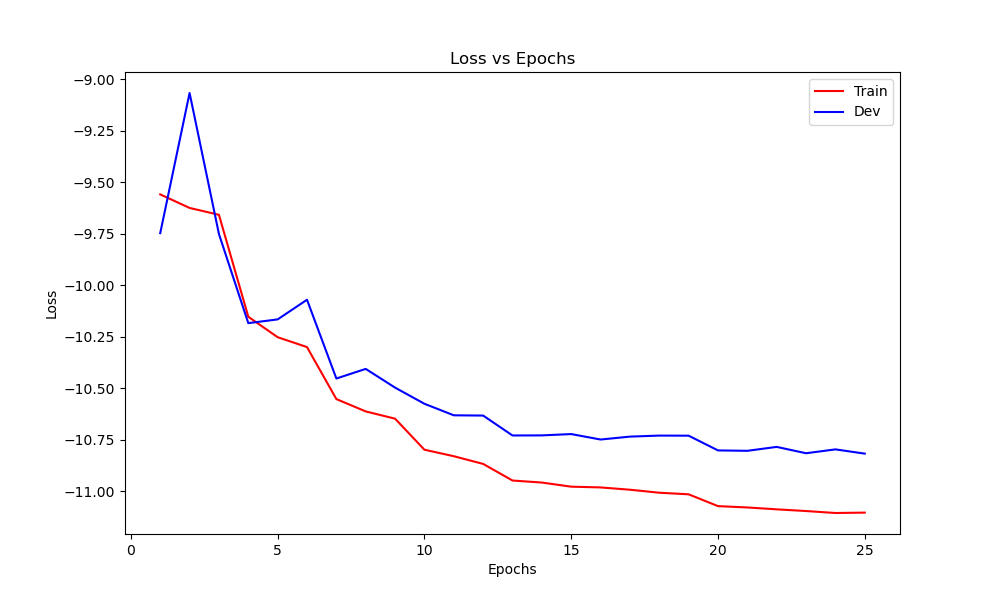

# denoiser

Speech denoising and source-separation experiments based on a convolutional neural network. The repository includes the baseline fusion model and a temporal-gate variant, training utilities, evaluation code, and the final training-loss figure.

## Environment

Create the environment defined in `environment.yml`:

```bash
conda env create -f environment.yml
conda activate denoiser
pip install torch soundfile
```

Python 3.11 is used by the supplied environment file. Training requires a CUDA-capable PyTorch installation when GPUs are specified.

## Training

Prepare mixture and reference SCP files for the dataset, then run:

```bash
python trainnew_blue.py --gpus 0 --epochs 50 --checkpoint <checkpoint_dir> --batch-size 2 --num-workers 0 --trainer_type repeat
```

The command recorded in `train_blue.sh` shows the configuration used for the final run. Dataset and checkpoint paths are machine-specific and must be replaced with local paths.

## Final result

The training-loss curve from the final experiment is included below.



Model checkpoint archives are excluded from Git to keep the repository lightweight. Supply them locally when reproducing training or evaluation.
